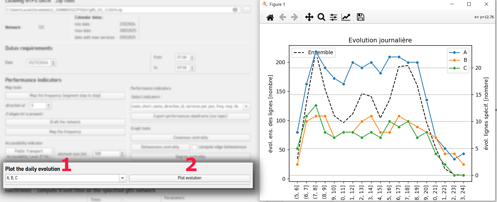
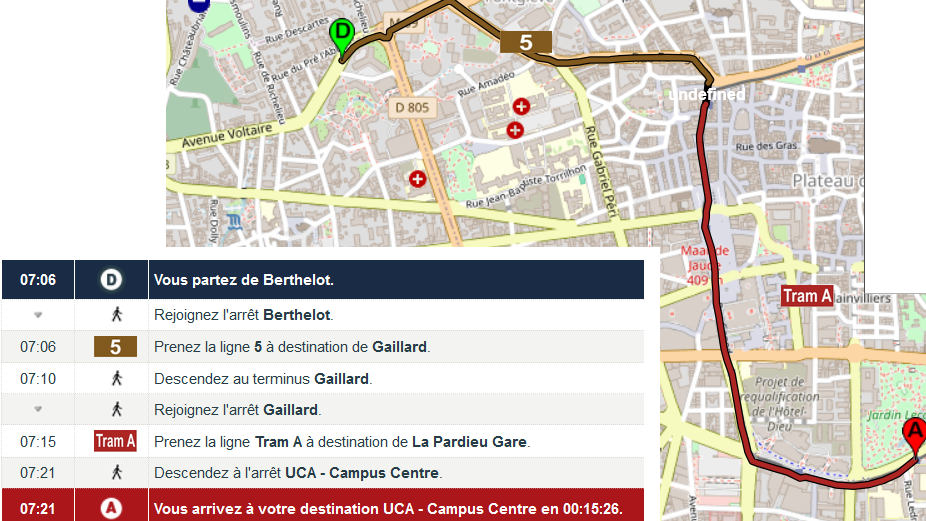

Expreseau GTFS

Aide à l'utilisation du plugin QGIS 3.* **Expreseau GTFS**
Plugin pour QGIS basé sur la librairie python expreseau_gtfs : https://github.com/lufages/expreseau_gtfs

## Charger un fichier GTFS (dossier *.zip)

Cela va automatiquement modifier la date pour choisir un mardi. 
Il s'agit du mardi suivant la date minimale enregistrée dans le fichier *calendar.txt*.
La plage horaire est choisie par défaut de 7h à 9h.

#### Figure : Charger un fichier GTFS 

## Indicateurs de performance

### Cartographier la fréquence 
Il est possible de cartographier la fréquence tronçon par tronçon (c'est-à-dire arrêt à arrêt)./
 Le résultat est une couche de lignes avec une valeur numéraire à classer. C'est la variable *nbtrips* 
 (nombre de voyages sur la plage horaire choisie et dans la direction choisie : direction_id = 0 ou 1)

#### Figure : cartographier la fréquence dans la direction 0

#### Figure : Classer la variable *nbtrips* par valeur

### Cartographier le réseau
Si le fichier *shapes.txt* est présent dans le jeu de données GTFS il est possible de cartographier
 chaque ligne du réseau mais également de cartographier la fréquence moyenne par ligne.
 
 
 
### Créer une table csv d'indicateurs de performance
Il est possible de choisir de ne pas calculer certains indicateurs proposés en les
désélectionnant dans la checkable combobox.

Liste d'indicateurs :
 - route_short_name : nom court de la ligne
 - direction_id :  direction du trips : 0 ou 1
 - services par jour : nombre de services par jour dans toutes les directions pour la date choisie
 - freq. moy. de 7 à 9
 - freq. moy. de 12 à 14
 - freq. moy. de 16 à 19
 - hmin : heure du premier départ
 - hmax : heure du dernier départ
 - amplitude(sec) :  amplitude journaliàre
 - freq. moy. corrigee - 7 a 9, 12 a 14, 16 a 19 : fréquence pondérée par le nombre de voyages par tronçon.

#### Résultats

## Tracer l'evolution journaliere de la frequence sur le reseau

Il est possible de choisir des lignes à tracer (point 1. cf. image ci-dessus).
L'evolution est tracee entre 5h et minuit.

### Outils issus de la science des graphes :

D'apràs Cats, Oded. "Topological Evolution of a Metropolitan Rail Transport Network: The Case of Stockholm".
 Journal of Transport Geography 62 (juin 2017): https://doi.org/10.1016/j.jtrangeo.2017.06.002.
 
--Figure : Graph tools**

 
Les outils ci-dessous créent des couches de points qu'il s'agira de faire varier selon les valeurs.
Issus de : https://networkx.org/

#### Betweenness centrality

L'indicateur *Betweeness centrality* est, pour un noeud donné, la fraction de la somme de l'ensemble des itinéraires de toutes les paires de noeuds passant par le noeud.
La fraction signifie que la valeur est divisée par le nombre de noeuds du graphe.

Ci-dessous, l'indicateur calculé à chaque noeud (arrêt du réseau). La valeur varie avec la taille. Les valeurs élevées permettent de voir quels sont les noeuds les plus empruntés du réseau,
ce qui montre d'une part la desserte du noeud et d'autre part les points de fragilité du réseau,
dans la mesure où un ou plusieurs noeuds successifs présentant des valeurs élevées sont en réalité des goulots d'étranglement.

**Figure : Betweenness centrality**

#### Closeness centrality

L'indicateur de *Closeness centrality* correspond à pour chacun des noeud du graphe à l'inverse de la somme des temps de parcours vers l'ensemble des noeuds du graphe.
Plus l'indicateur est élevé, plus la somme des temps pour rejoindre l'ensemble des arrêts du réseau est faible,et cela signifie que le noeud est tràs bien desservi.

Ci-dessous, l'exemple de Clermont-Ferrand, montre les noeuds et les «couloirs« de desserte élevée.

**Figure : Closeness centrality**

#### Degree centrality

L'indicateur *Degree centrality*, est, pour un noeud, la fraction de noeuds qui lui est connectée. Plus le degré est élevé, plus le noeud est connecté au réseau.

**Figure : Closeness centrality**

## Calcul d'itinéraires sur le réseau de transports

Le calcul d'itinéraire repose sur les algorithmes de calcul du plus court chemin en science des graphes.
Ici, nous avons adapté l'algorithme de Dijkstra au calcul d'itinéraire sur un réseau de transports.
Les noeuds du graphe sont les arrêts du réseau et les arêtes du graphe sont les connexions entre les arrêts.
La pondération utilisée pour l'algorithme Dijsktra est le temps de parcours entre deux arrêts, issu des tables horaires.
On considàre que le transfer entre deux arrêts (correspondance de ligne) se fait à pied, à une vitesse de marche de 4 km.h-1
et que l'individu peut atteindre les arrêts autour de lui dans un rayon à vol d'oiseau, pondéré par un facteur «crow flies distance«, mais
il est tout à fait possible de faire varier ces paramàtres d'entrée et en particulier l'algorithme :

  - Dijkstra with max transfer : Dijsktra adapté avec un nombre de correspondances maximales ;
  - Dijkstra classique ;
  - Plus court chemin sans pondération.
  
  
étapes :
1. Sélectionner les points (couche point) ou cliquer sur le bouton et sélectionner la position dans le fond de carte en LAMBERT 93 pour les points de départ et d'arrivée ;
2. Paramàtres modifiables ;
3. Cliquer sur "Calcul d'itinéraire". Une fois le calcul terminé, le temps s'affichera et la couche ligne de l'itinéraire sera créée.
On peut distinguer la couche par ligne en catégorisant la couche par la variable «route«.

**Exemple**

**Résultats - issus du calculateur d'itinéraires de T2C (Régie de transports àClermont-Ferrand)** 

**Remarques** :  le calculateur ne permet pas de calculer un trajet àun horaire précis en donnant des horaires de correspondances précis.
L'outil permet de calculer le trajet le plus court en temps entre deux points, sur une plage horaire. 
Il est davantage conçu pour déterminer une accessibilité en temps de parcours que pour renvoyer une feuille de route.

 
## Isochrones

Le calculateur d'isochrones fonctionne sur la base de l'algorithme Dijkstra : il détermine les arrêts atteignables dans le temps imparti.
A chaque arrêt de l'enveloppe concave, on récupàre le temps potentiel de parcours restant
(c'est-Ã-dire, si le temps de parcours maximal est de 1h, si l'individu met 45min à atteindre un arrêt,
le temps potentiel de parcours restant est de 1h - 45min = 15min), et on trace un buffer d'une distance
correspondant à la distance réalisable à la vitesse spécifiée, le tout pondéré par un facteur *crow flies distance*.

**Paramétrage**
 
Il est possible d'amender le calcul d'isochrones avec une API de l'IGN qui permet de calculer un isochrone sur la base du réseau routier ou pédestre français.
 

**Résultats**

 

## Indice d'accessibilité - *PTAL : Public Transport Accessibility Network*

D'apràs : Transports for London. "Assessing transport connectivity in London", 2015. 

Le PTAL est une mesure de l'accessibilité au réseau de transports en commun utilisée par les aménageurs de l'espace public à Londres.
Pour chaque élément discret, le PTAL représente comment l'élément est connecté au réseau de transports.
Il peut être vu comme la mesure de la densité spatiale de transport public.
Le PTAL varie de 0 à 40 ou plus (elle est ensuite ramenée de 0 à 6). Un élément aura une valeur élevée si :
- Il y a une courte distance à pied à réaliser pour rejoindre des arrêts ;
- Les temps d'attentes aux arrêts les plus proches sont faibles ;
- La desserte à ces arrêts est bonne ;
- Il y a un arrêts majeur du réseau proche ;
- Une combinaisons des caractéristiques ci-dessus.

    
Les recommandations d'accessibilité par les aménageurs se font selon la densité de population, c'est ce que montre la figure ci-dessous.

**Figure : PTAL vs. densité de population, d'apràs : Transports for London. "Assessing transport connectivity in London", 2015, page 6**

Le calcul d'accessibilité via l'indicateur PTAL permet de définir un niveau d'accessibilité partout sur le territoire de l'AOM le jour et la plage horaire choisie.

Il est ensuite possible de choisir la taille des éléments de la grille de découpage du territoire (voir sur la figure ci-dessous, *element size*).

La grille se construit en prenant l'emprise rectangulaire que forment les arrêts (lattitude min et max, longitude min et max). 
Elle est ensuite découpée en éléments carrés de taille spécifiée.

**Figure : mise en oeuvre de l'indicateur**

**Figure : résultats sur le PTU de Clermont-Ferrand**

Dans notre exemple les valeurs les plus élevées de PTAL se concentrent dans les zones urbaines les plus denses, autour du réseau de tramways.

**Figure : que dit la documentation de l'indicateur ?**

D'après Transports for London. "Assessing transport connectivity in London", 2015, page 19.

 
 

